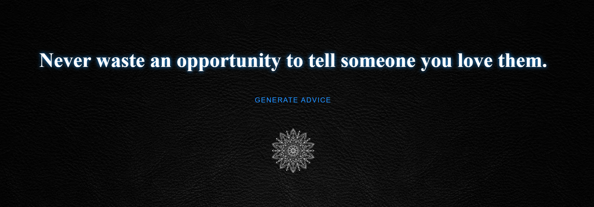

<h1 align="center">
     Advices Messages

</h1>

<h3 align="center">
    Advices generator
</h3>

<p align="center">
  

  
  
  <a href="https://github.com/Agencia-CodeX/advice-messages-neon/commits/main">
    
  </a>
    
   
  
  
  
 
</p>

<h4 align="center">
	🚧   Completed 🚀 🚧
</h4>

## 💻 About the project

Advices generator - is an application developed in React js with Next js and Typescript that consumes an external API returning an advice.

---

## ⚙️ Functionalities

- [x] Make the query in an external api.
- [x] Displays random advice.
- [x] Allows the generation of a new advice.
---

## 🎨 Layout



---

## 🚀 How to run the project

### Pré-requisitos

Before starting, you will need to have the following tools installed on your machine:
[Git](https://git-scm.com), [Yarn](https://yarnpkg.com/), [node](https://nodejs.org/en/). 
Besides, it's good to have an editor to work with the code like [VSCode](https://code.visualstudio.com/)

#### 🎲 Running

```bash

# Clone this repository
$ git clone https://github.com/Agencia-CodeX/advice-messages-neon.git

# Access the project folder in terminal/cmd
$ cd advice-messages-neon

# install the dependencies
$ yarn

# Run the application in development mode
$ yarn dev

# The server will start on port:3000 - go to http://localhost:3000

```

---

## 🛠 Technologies

The following tools were used in building the project:

#### **Website**  ([React js](https://reactjs.org/)  + [Next js](https://nextjs.org/) + [TypeScript](https://www.typescriptlang.org/) + [Sass](https://sass-lang.com/))

-   ReactJS
-   NextJs
-   TypeScript
-   Sass

> See the file  [package.json](https://github.com/Agencia-CodeX/advice-messages-neon/blob/main/package.json)

## 🦸 Author


 <br />
 <sub><b>CodeX Agency</b></sub></a> 🚀
 <br><br>

[](miguelmarcola@gmail.com)

---

## 📝 Licença

This project is under license [MIT](./LICENSE).

Made with great dedication by CodeX Agency 👋🏽 [Contact!](https://www.linkedin.com/in/miguel-mar%C3%A7ola-28535a151/)

---
